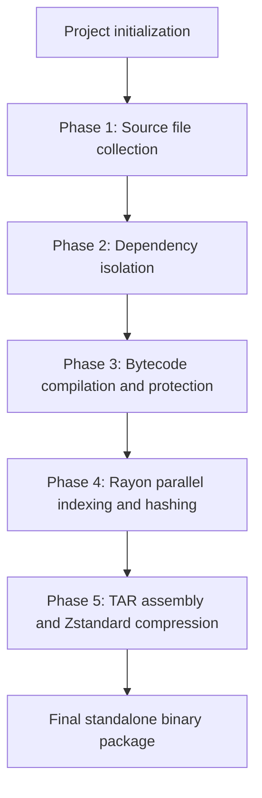
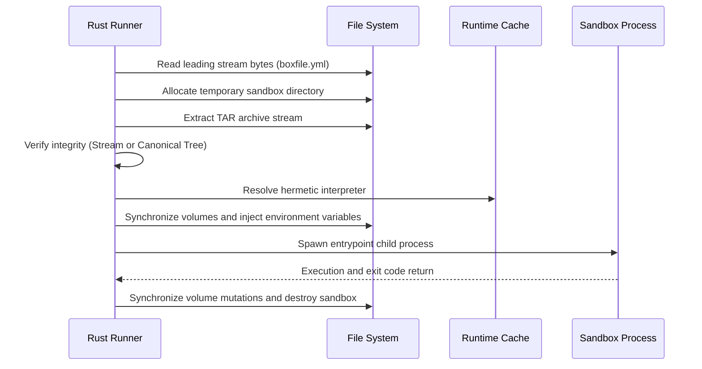

# Build engine and sandbox execution architecture

This document describes the internal mechanics of archive construction, integrity verification, and hermetic execution within the Box CLI Rust engine.

## Container format architecture

A `.box` package file is a self-contained application container composed of a standard TAR archive compressed via a continuous Zstandard stream.

```text
Structure of the .box container
+-----------------------------------------------------------------------+
| Continuous TAR stream compressed via Zstandard                        |
|                                                                       |
| [Entry 1] boxfile.yml   -> Configuration manifest (offset 0)          |
| [Entry 2] Sources/Obj   -> Application files or compiled bytecode     |
| [Entry 3] Dependencies  -> node_modules/ or _box_lib/                 |
| [Entry 4] Env Schema    -> env.example (if declared)                  |
+-----------------------------------------------------------------------+
```

### Manifest placement

The `boxfile.yml` file is located at the first position within the TAR header table. This layout allows inspection and initialization routines to read package metadata immediately from the beginning of the binary stream without decompressing or traversing the entire payload.

### Integrated cryptographic checksums

The container integrates two distinct tiers of integrity signatures computed during assembly:

- `payload_sha256`: SHA-256 hash computed over the raw binary stream of the TAR archive containing all files except the manifest.
- `tree_sha256`: SHA-256 hash of the canonical sorted tree, generated by concatenating formatted lines of `path:size:sha256\n` for every embedded file.

## Build process

The `src/builder.rs` module coordinates package creation through five sequential phases.



### Phase 1: Source tree collection and filtering

The engine locates the `boxconfig.yml` or `boxconfig.yaml` configuration file at the root of the source directory.

1. An isolated ephemeral staging directory is allocated using the `tempfile` module.
2. If the `include` directive is explicitly defined, only the specified paths are copied into the staging area.
3. If the `include` directive is absent, the engine automatically includes the `src` and `app` directories along with the file declared in the `entrypoint` directive.
4. Ephemeral and cache directories such as `.git`, `.venv`, and `__pycache__` are excluded from staging.

### Phase 2: Production dependency isolation

The runtime subsystem prepares the dependency environment without altering the host system:

- **Node.js runtime**: If a `package.json` file or package list is declared, the engine invokes the hermetic Node.js interpreter paired with an embedded `npm-cli.js` installer. Installation targets the staging `node_modules/` directory with production flags (`--omit=dev`, `--no-audit`, `--no-fund`).
- **Python runtime**: If a `requirements.txt` file or module list is declared, the engine executes the standalone `pip.pyz` binary bootstrap to install packages into an isolated `_box_lib/` directory inside the staging area.

### Phase 3: Source code compilation and protection

When the `protect: true` flag is enabled in the configuration:

- **Node.js and TypeScript protection**:
  - TypeScript source files (`.ts`) are transpiled into standard JavaScript.
  - Each JavaScript module is compiled into native V8 bytecode cache (`.jsc`) via the V8 script compilation cache API.
  - Original source files (`.ts`, `.js`) are deleted from the staging directory.
  - A startup loader `_box_node_loader.js` is generated to deserialize and execute the V8 bytecode at runtime without exposing plain source code.
- **Python protection**:
  - Source code is compiled into binary `.pyc` bytecode using the `compileall` module.
  - Corresponding raw `.py` source files are stripped from staging.

### Phase 4: Parallel multi-core indexing

The engine computes cryptographic checksums across all staging files using parallel worker threads managed by the `rayon` crate:

1. Individual SHA-256 computation for every physical file in staging.
2. Assembly of the internal JSON structure containing relative paths, byte sizes, and individual file hashes.
3. Computation of the canonical `tree_sha256` tree hash.

### Phase 5: TAR assembly and Zstandard compression

1. A temporary in-memory TAR stream is created containing all application files and runtime dependencies.
2. The `payload_sha256` digest is calculated from this stream.
3. The `payload_sha256`, `tree_sha256`, and complete file list are injected into the `boxfile.yml` structure.
4. The final TAR container is assembled by writing `boxfile.yml` first, followed by all payload files.
5. The complete TAR stream is compressed using the Zstandard algorithm at the configured compression level (level 3 by default, configurable up to 22) and written to disk.

## Sandbox execution process

The `src/runner.rs` module manages the application lifecycle inside an isolated temporary sandbox.



### Phase 1: Extraction and sandbox instantiation

1. A unique temporary directory is allocated on the host machine using `tempfile::tempdir()`.
2. The archive is decompressed on the fly using the Zstandard decompressor.
3. Application files and dependencies are unpacked into the sandbox.

### Phase 2: Dual-tier cryptographic integrity verification

The engine runs a two-tier verification system to ensure performance and cross-engine compatibility:

- **Direct tier (Stream Hash)**: The engine compares the reconstructed TAR stream binary hash against `payload_sha256`. If the digest matches, integrity is verified immediately.
- **Canonical tier (Tree Hash Fallback)**: If TAR headers differ (such as archives created by other TAR tools), the engine performs a file-by-file verification against individual file hashes and `tree_sha256`. Execution is halted only if files are corrupted or missing.

### Phase 3: Hermetic runtime provisioning

The engine checks the local cache located at `~/.box/runtimes/`:

- If the required runtime binary (specific Python or Node.js version) exists, it is selected directly.
- If the runtime is missing, the engine downloads the standalone binary distribution, verifies its checksum, and extracts it into the local cache.
- Execution does not depend on any globally installed interpreters on the host system.

### Phase 4: Parameter injection and process execution

1. **Environment variables**: Values resolved from `.env` files and validated against the schema are loaded.
2. **Persistent volumes**: Persistent storage directories are synchronized with sandbox mount points.
3. **Execution**: The child process is executed with configured module search paths (`PYTHONPATH` targeting `_box_lib/` or `NODE_PATH` targeting `node_modules/`).
4. **Cleanup**: Upon process termination, mutations in persistent mount points are committed back to host storage, and the ephemeral sandbox directory is deleted from disk.

## Package inspection process

The `src/inspector.rs` module performs static analysis on `.box` files:

1. Opens the file and selectively decompresses the initial Zstandard stream.
2. Deserializes `boxfile.yml` or `manifest.json` to extract configuration.
3. Scans headers to detect bytecode compilation (`.jsc`, `.pyc`) and the presence of an `env.example` template.
4. Outputs structured metadata including SHA-256 signatures, volume mounts, target runtimes, and protection status.
