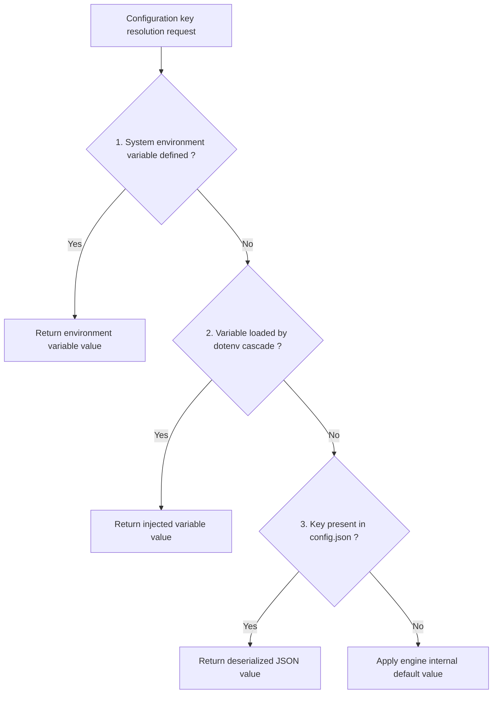
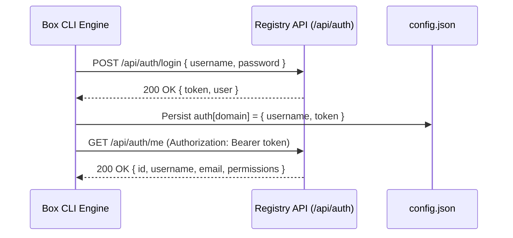

# Global configuration and authentication protocol

This document describes the configuration management architecture, parameter resolution cascade, and remote registry authentication protocol in the Box CLI Rust engine.

## Local storage hierarchy

The engine centralizes persistent data, configuration files, and isolated runtimes in a base directory resolved by the `src/config.rs` module.

```text
Directory layout of base storage ~/.box
+-----------------------------------------------------------------------+
| ~/.box/ (or custom directory configured via BOX_HOME)                 |
|                                                                       |
| config.json      -> Global settings and authentication tokens         |
| .env             -> Optional global environment variables             |
| runtimes/        -> Binaries and libraries of isolated interpreters   |
| volumes/         -> Physical host storage for persistent volumes      |
+-----------------------------------------------------------------------+
```

### Dynamic path resolution

The primary working directory is resolved according to the following order:

1. If the `BOX_HOME` environment variable is defined and non-empty, its path is used as the storage root.
2. In the absence of this variable, the default path resolves to the `.box` subfolder inside the user home directory (`BaseDirs::home_dir`).
3. The interpreter cache directory resolves via `BOX_RUNTIMES_DIR` or defaults to the `runtimes/` subfolder.
4. The persistent volumes directory resolves via `BOX_VOLUMES_DIR` or defaults to the `volumes/` subfolder.

The engine creates missing directories automatically during subsystem initialization via `std::fs::create_dir_all`.

## Parameter resolution cascade

When reading a configuration key, the engine applies an ordered evaluation cascade to determine the effective runtime value.



### Resolution priority tiers

- **Tier 1: Direct environment variables**: Variables passed directly to the main process have the highest priority.
- **Tier 2: Variables discovered via dotenv**: Variables loaded from the locally resolved `.env` file hierarchy are processed next.
- **Tier 3: Structured configuration file `config.json`**: In the absence of environment variables, values are read from the JSON document on disk.
- **Tier 4: Internal engine defaults**: When no configuration is detected, the engine applies hardcoded default values.

### Configuration key mapping table

| Internal key | Associated variable | Type | Technical role | Default value |
| :--- | :--- | :--- | :--- | :--- |
| `hub_url` | `BOX_HUB_URL` | String | Package registry root URL | None (required for push and pull) |
| `compression_level` | `BOX_COMPRESSION_LEVEL` | Integer | Zstandard compression level | 3 |
| `build_workers` | `BOX_BUILD_WORKERS` | Integer | Rayon parallel worker thread count | CPU logical core count |
| `network_timeout` | `BOX_NETWORK_TIMEOUT` | Integer | Network timeout in seconds | 60 |
| `python_mirror` | `BOX_PYTHON_MIRROR` | String | Download mirror for Python runtimes | Official mirror |
| `node_mirror` | `BOX_NODE_MIRROR` | String | Download mirror for Node.js runtimes | Official mirror |

## Configuration data model

The `config.json` document uses a structured schema serialized via `serde_json`.

```json
{
  "hub_url": "https://boxhub.paxiz.org",
  "compression_level": 3,
  "build_workers": 8,
  "network_timeout": 60,
  "python_mirror": null,
  "node_mirror": null,
  "auth": {
    "boxhub.paxiz.org": {
      "username": "administrator",
      "token": "eyJhbGciOiJIUzI1NiIsInR5cCI6IkpXVCJ9..."
    }
  },
  "custom": {}
}
```

### Internal memory structures

In the Rust source code, this structure corresponds to the following types:

- `AuthCredential`: Structure encapsulating the username and corresponding JWT token.
- `AppConfigData`: Global structure containing standard options and an `auth` hash map keyed by registry host name to support multi-registry authentication.

## Remote registry authentication protocol

The `src/registry.rs` module manages credentials exchange, session token persistence, and identity verification with the remote registry.



### Phase 1: Credentials exchange and token generation

1. The CLI extracts the host name from the target registry URL.
2. An HTTP `POST` request is dispatched to `/api/auth/login` containing the JSON payload with `username` and `password` fields.
3. The registry server authenticates the credentials and returns a signed JWT authentication token.
4. The CLI persists the `AuthCredential` structure in the `auth` section of `config.json` under the key corresponding to the target domain.

### Phase 2: Identity validation and session verification

When verifying authentication state:

1. The CLI retrieves the token associated with the target registry domain from the `auth` table.
2. An HTTP `GET` request is sent to `/api/auth/me` with the `Authorization: Bearer <token>` header.
3. The server validates the token signature and returns the user profile, quotas, and email address.
4. If the token has expired or is invalid, the server returns HTTP 401 and the CLI reports session invalidation.

### Phase 3: Local session revocation

When logging out:

1. The CLI identifies the entry corresponding to the target domain in the `auth` table of `config.json`.
2. The entry is removed from the in-memory `AppConfigData` structure.
3. The updated `config.json` document is written back to disk atomically.
