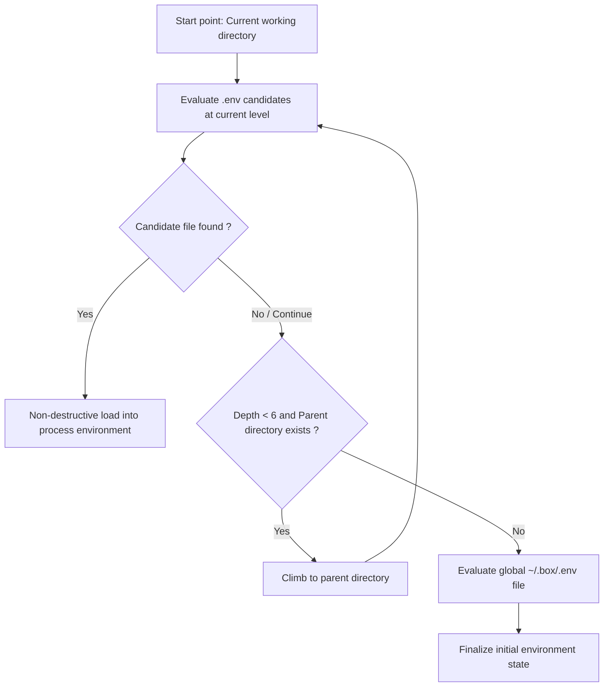
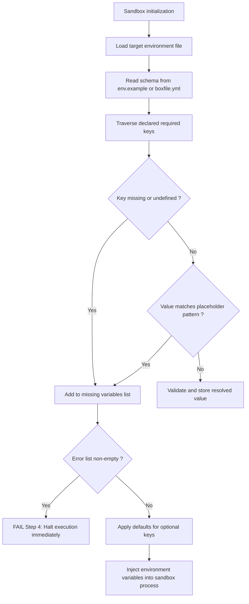

# Environment resolution and schema validation

This document describes the configuration discovery algorithm, environment variable priority cascade, and schema validation engine in Box CLI Rust.

## Environment variable discovery and loading algorithm

Environment variable initialization is performed by the `bootstrap_dotenv()` function defined in `src/config.rs`. This function executes an ascending directory traversal algorithm.



### Evaluation sequence per directory level

At each traversed directory level, the engine tests for candidate files in the following order:

1. `.env.local`
2. `.env`
3. `.env.production`
4. `.env.development`

### Immutability rules and hierarchical resolution

- Loading is powered by `dotenvy::from_path`.
- When a variable is loaded from a specific local file (such as `.env.local`), its value becomes immutable for the active process instance.
- Files located in parent or less specific directories cannot overwrite an already defined key.
- The global `~/.box/.env` file is evaluated last as a fallback to supply user-wide defaults.

## Environment schema specification

The engine supports two specification methods for declaring expected application environment variables:

### Inline configuration declaration

Variables can be declared directly in `boxconfig.yml` under the `env` key:

```yaml
name: my-service
version: 1.0.0
runtime:
  type: node
  version: "20.11"
  entrypoint: server.js

env:
  PORT:
    description: HTTP server listen port
    default: "8080"
    required: false
  DATABASE_URL:
    description: Database connection URI
    required: true
  SECRET_KEY:
    description: Cryptographic key for session signing
    required: true
```

The shorthand list format is also parsed and transformed by the deserializer in `src/manifest.rs`:

```yaml
env:
  - PORT=8080
  - DATABASE_URL
  - SECRET_KEY
```

### Dedicated external schema template

When the `env_schema: env.example` directive is declared in `boxconfig.yml`:

```ini
# Schema file env.example
PORT=8080
DATABASE_URL=
SECRET_KEY=your_secret_key_here
API_TOKEN=YOUR_API_TOKEN_HERE
```

During package assembly (`src/builder.rs`), the `env.example` file is extracted, normalized, and embedded at the root of the `.box` container.

## Runtime validation engine

During the execution phase in `src/runner.rs`, the engine applies an integrity verification check on environment variables before allowing process execution.



### Placeholder value detection algorithm

The engine filters and inspects the values assigned to required keys to prevent running an application with unconfigured sample data:

1. Empty lines and comment lines starting with `#` are ignored.
2. Each line is split on the first equals sign (`=`).
3. The assigned value is trimmed of leading and trailing whitespace.
4. If the trimmed value starts with recognized example prefixes (`YOUR_`, `votre_token_discord_ici`, `changeme`), or if a required value is empty, the variable is categorized as unconfigured.

### Constraint violation reporting

If one or more required variables fail validation:

- The engine logs the specific identifier of each failing key.
- The environment configuration phase is marked as failed.
- Child process execution is blocked prior to runtime interpreter instantiation, protecting the application against initialization crashes.

## Sandbox process environment isolation

To maintain complete sandbox hermeticity:

- Variables resolved and validated by the engine are explicitly injected into the child process environment vector via `std::process::Command::envs()`.
- Extraneous host system variables do not contaminate the isolated application context.
- Module resolution paths (`PYTHONPATH` for Python or `NODE_PATH` for Node.js) are restricted to libraries bundled inside the sandbox (`_box_lib/` or `node_modules/`).
