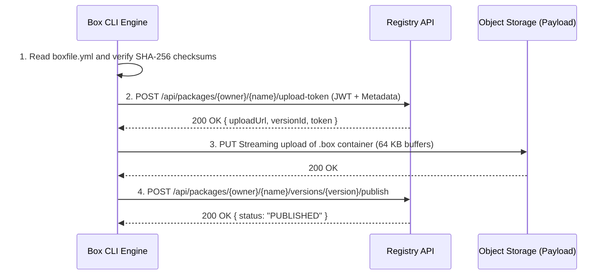
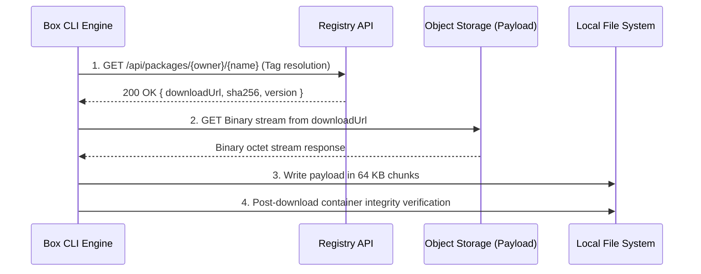

# Registry transfer protocol and remote synchronization

This document describes the package identification grammar, REST API endpoints, streaming publication mechanics, and download protocol in the Box CLI Rust engine.

## Package specifier grammar and lexical parsing

The `src/registry.rs` module parses and decomposes package identifiers according to a formal grammar:

```text
Formal grammar of package specifiers
[<registry_url>/][<owner>/]<package_name>[:<tag>]
```

### Syntax components

- **Registry host name (optional)**: Root URL of an alternative registry. When omitted, the engine uses the value configured under `hub_url`.
- **Owner (optional)**: User account or organization identifier hosting the package. When omitted, the CLI supplies the username of the currently authenticated account.
- **Package name (required)**: Alphanumeric package identifier (supporting hyphens and underscores).
- **Version tag (optional)**: Semantic tag or release label. When omitted, the `latest` tag is applied by default.

## Registry REST API endpoints

Communication between the CLI and the Box Cloud Registry uses secure HTTP requests over TLS.

| HTTP method | Endpoint | Technical role | Authentication |
| :--- | :--- | :--- | :--- |
| `GET` | `/api/packages/{owner}/{name}` | Tag resolution and package metadata query | Optional (if public) |
| `POST` | `/api/packages/{owner}/{name}/upload-token` | Permission check and upload URL negotiation | Bearer JWT Token |
| `PUT` | `/api/packages/{owner}/{name}/versions/{version}/payload` | Continuous binary stream upload of .box file | Bearer JWT Token |
| `POST` | `/api/packages/{owner}/{name}/versions/{version}/publish` | Final verification and state commitment | Bearer JWT Token |
| `GET` | `/api/packages/{owner}/{name}/versions/{version}/download` | Binary download stream for target package artifact | Optional (if public) |

## Package publication protocol

The publication workflow implemented in `src/registry.rs` executes a five-phase sequence:



### Phase 1: Local artifact verification

Prior to any network operation, the CLI inspects the local `.box` binary file:

1. Selectively decompresses the beginning of the container to extract and validate `boxfile.yml`.
2. Asserts required fields (`name`, `version`, `runtime`, `entrypoint`).
3. Computes and confirms local cryptographic checksums `payload_sha256` and `tree_sha256`.

### Phase 2: Upload token negotiation

1. The CLI reads the JWT token registered for the target registry in `config.json`.
2. An HTTP `POST` request is sent to `/api/packages/{owner}/{name}/upload-token` with the `Authorization: Bearer <token>` header.
3. The JSON payload conveys metadata extracted from the manifest:
   - Version and target tag.
   - Package visibility (`isPrivate: true` or `false`).
   - Target runtime specifications (`type`, `version`, `entrypoint`).
   - Description and associated `README.md` text.
   - Cryptographic payload hash.
4. The API verifies user permissions, reserves the version record, and returns a signed destination upload URL.

### Phase 3: Continuous stream transfer

The `.box` file is read in 64 KB chunks and transmitted via an HTTP `PUT` request:

- The transfer uses a stream wrapper measuring byte throughput in real time.
- The engine updates transfer counters, instantaneous speed metrics (MB/s), and estimated time to completion (ETA).

### Phase 4: Confirmation and publication

Once the payload stream has been transferred and verified by the storage backend:

1. The CLI issues an HTTP `POST` confirmation request to the publish endpoint.
2. The registry locks the version record, indexes metadata in the package catalog, and transitions package status to `PUBLISHED`.

## Package download protocol

Downloading a remote package executes dynamic tag resolution followed by secure stream retrieval.



### Phase 1: Tag and metadata resolution

1. The CLI sends an HTTP `GET` request to the registry API specifying the package owner and name.
2. The API returns available versions and resolves the requested tag (`latest` or specific label) to the direct artifact download URL.

### Phase 2: Stream reception and disk writing

1. The download request opens an HTTP binary stream.
2. Data is read in 64 KB buffers and written directly to disk.
3. The engine computes real-time progress based on the total payload size provided in the `Content-Length` header.

### Phase 3: Post-download integrity verification

Upon network stream closure:

1. The CLI opens the downloaded file and validates container structure using the Zstandard decompressor.
2. The `boxfile.yml` manifest is deserialized to verify that internal signatures and package identifiers match the requested target.

## Auto-pull execution integration

The `src/runner.rs` module integrates a transparent auto-pull mechanism:

1. When the target passed to the runner does not match a physical file path on disk, the engine evaluates the string against the remote package grammar.
2. If the target matches a valid remote pattern (`<owner>/<name>:<tag>`), the engine triggers the download sequence automatically.
3. The downloaded container is verified and passed directly to the sandbox instantiation pipeline without manual user intervention.
