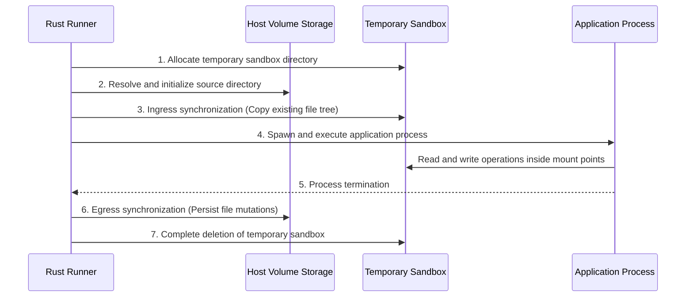
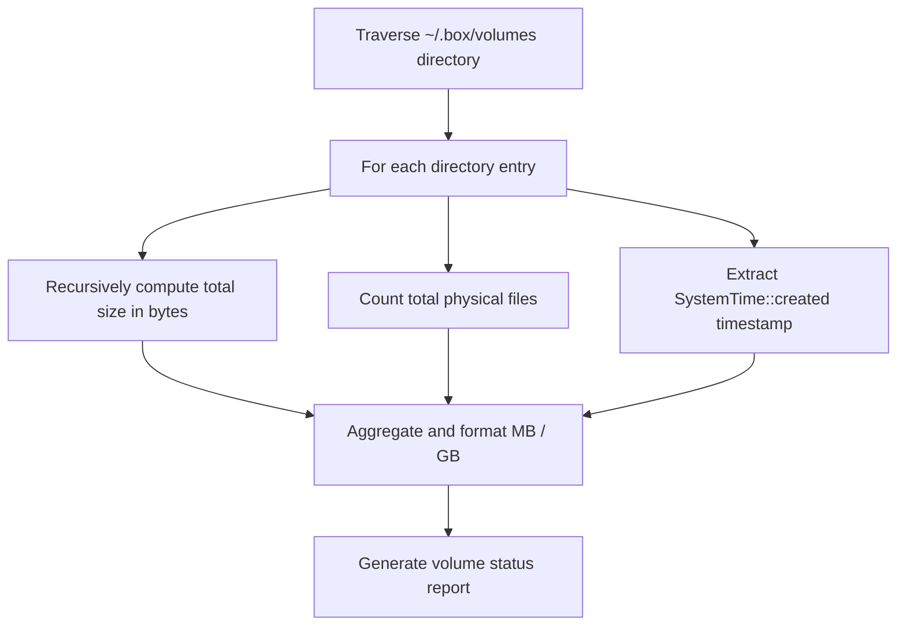

# Persistent storage architecture and sandbox volume synchronization

This document describes the physical storage architecture, mount specification grammar, bidirectional synchronization mechanisms, and volume administration algorithms in the Box CLI Rust engine.

## Persistence and isolation architecture

The execution sandbox instantiated by the engine is ephemeral by design: upon process termination, the temporary sandbox directory is destroyed to prevent residue accumulation on the host system.

The volume subsystem defined in `src/volume.rs` routes and persists application state between execution sessions.

```text
Storage topology and data flow
+-----------------------------------------------------------------------+
| Host system (Physical persistent storage)                             |
|                                                                       |
| ~/.box/volumes/<volume_name>/                                         |
|   ├── database.sqlite                                                 |
|   └── uploads/                                                        |
+-----------------------------------┬-----------------------------------+
                                    │ Ingress and Egress synchronization
                                    ▼
+-----------------------------------------------------------------------+
| Ephemeral sandbox (tempdir)                                           |
|                                                                       |
| /app/                                                                 |
|   ├── main.py                                                         |
|   ├── _box_lib/                                                       |
|   └── data/ ◄── Virtual mount point                                   |
|         ├── database.sqlite                                           |
|         └── uploads/                                                  |
+-----------------------------------------------------------------------+
```

### Physical storage location

Named volumes are stored in isolated directories under `~/.box/volumes/` (or the custom location configured via `BOX_VOLUMES_DIR`). Each subfolder bears the name of the declared volume.

## Mount specifications and lexical parsing

The engine supports two physical linking methods to target sandbox mount points:

1. **Named persistent volume**: `<volume_name>:<sandbox_target>`
   - The source is an alphanumeric identifier (supporting hyphens and underscores).
   - The physical path is resolved automatically under `~/.box/volumes/<volume_name>/`.
2. **Direct host directory mount**: `<host_path>:<sandbox_target>`
   - The source is an absolute or relative path pointing to an existing directory on the host machine.

### Cross-platform lexical parser

On Windows operating systems, absolute file paths contain a colon following the drive letter (such as `C:\data`).

To prevent incorrect splitting between the source and target paths, the engine applies right-side splitting via `rsplit_once(':')`:

```rust
let (source_raw, target_raw) = match vol_spec.rsplit_once(':') {
    Some((s, t)) if !s.is_empty() => {
        if !t.is_empty() {
            (s.trim(), t.trim().trim_start_matches(['/', '\\']))
        } else {
            return Err("Invalid volume target path");
        }
    }
    _ => return Err("Invalid volume specification format"),
};
```

This approach isolates the target path on the right side while preserving the integrity of absolute source paths on the left side across all operating systems.

## Sandbox synchronization lifecycle

The lifecycle of persistent storage during application execution consists of five phases:



### Phase 1: Source resolution and preparation

1. The engine extracts all volume specifications passed at launch.
2. If the source is an existing host directory, the path is canonicalized.
3. If the source is a volume name, the corresponding directory under `~/.box/volumes/` is created if not already present.
4. The destination directory inside the sandbox is initialized.

### Phase 2: Ingress synchronization

Prior to launching the application:

1. The engine traverses the source volume file tree using `WalkDir`.
2. Every file and subfolder is replicated into the target path of the sandbox.
3. File permissions and nested directory structures are preserved.

### Phase 3: Isolated execution

The application operates inside the sandbox without direct unmediated access to the host file system outside of configured mount points. Disk writes occur locally in the temporary area without external I/O blocking.

### Phase 4: Egress synchronization and persistence

Upon receiving a termination signal or upon natural exit of the child process:

1. The engine scans the sandbox mount directories.
2. All files created, modified, or replaced during execution are copied back to the persistent volume on the host.
3. Additions and mutations are committed to the host storage.

### Phase 5: Sandbox destruction

Following confirmation of egress synchronization, the ephemeral sandbox directory is deleted from the host machine using `std::fs::remove_dir_all`.

## Volume administration algorithms

The `src/volume.rs` module provides inspection, volumetric calculation, and maintenance routines for local storage.



### Volumetric computation and metadata

Disk usage calculations are performed via recursive directory traversal:

- The `calculate_dir_size` function sums the byte sizes of all regular files, ignoring symbolic links.
- Creation timestamps are extracted directly from host file system metadata (`SystemTime`).

### Unused volume pruning algorithm

The pruning routine (`handle_volume_prune`) identifies and cleans up orphan volumes:

1. Reads all directory entries in the root volume directory.
2. For each volume directory, computes byte size and file count.
3. If total size is 0 bytes and file count is 0, the empty directory is deleted.
4. Volumes containing active data are preserved.
