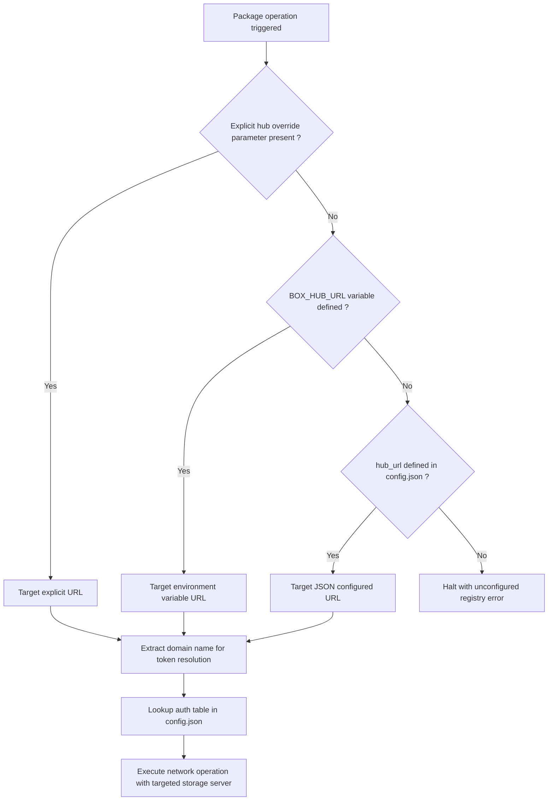

# Custom storage and registry configuration

This document describes the technical configuration model for overriding the default Box Cloud Registry hub, directing package storage to self-hosted private registries, and customizing local runtime mirror endpoints in the Box CLI Rust engine.

## Registry hub and storage topology

By default, the engine connects to the official Box Cloud Registry endpoint (`https://boxhub.paxiz.org`). Users and enterprise environments can redirect the storage backend, artifact distribution endpoints, and runtime mirrors to private self-hosted servers.

```text
Storage and registry topology models
+-----------------------------------------------------------------------+
| Default Public Hub Model                                              |
|                                                                       |
| Box CLI  ──► Official Hub: https://boxhub.paxiz.org                   |
|              ├── Package Index: /api/packages                         |
|              ├── Authentication: /api/auth                            |
|              └── Storage: Object Store (S3 / Cloud)                   |
+-----------------------------------------------------------------------+

+-----------------------------------------------------------------------+
| Self-Hosted Private Registry Model                                    |
|                                                                       |
| Box CLI  ──► Custom Endpoint: https://registry.internal.enterprise    |
|              ├── Custom Package Index and Metadata                    |
|              ├── Custom JWT Authentication                            |
|              └── Dedicated Private Storage Backend                    |
+-----------------------------------------------------------------------+
```

## Configuration parameters for custom registries

The engine recognizes dedicated configuration keys to redirect network traffic away from the default hub.

| Configuration key | Environment variable | Data type | Technical role | Default endpoint |
| :--- | :--- | :--- | :--- | :--- |
| `hub_url` | `BOX_HUB_URL` | String | Base URL of the package registry and storage backend | `https://boxhub.paxiz.org` |
| `python_mirror` | `BOX_PYTHON_MIRROR` | String | Alternative download mirror for standalone Python runtimes | Official CDN mirror |
| `node_mirror` | `BOX_NODE_MIRROR` | String | Alternative download mirror for standalone Node.js runtimes | Official CDN mirror |
| `network_timeout` | `BOX_NETWORK_TIMEOUT` | Integer | HTTP client connection and read timeout in seconds | 60 |

## Configuration file specification (`config.json`)

Self-hosted endpoints and per-domain authentication tokens are persisted in `~/.box/config.json`.

```json
{
  "hub_url": "https://registry.internal.enterprise",
  "compression_level": 3,
  "build_workers": 8,
  "network_timeout": 120,
  "python_mirror": "https://mirror.internal.enterprise/runtimes/python",
  "node_mirror": "https://mirror.internal.enterprise/runtimes/node",
  "auth": {
    "registry.internal.enterprise": {
      "username": "infrastructure-admin",
      "token": "eyJhbGciOiJIUzI1NiIsInR5cCI6IkpXVCJ9..."
    },
    "boxhub.paxiz.org": {
      "username": "public-user",
      "token": "eyJhbGciOiJIUzI1NiIsInR5cCI6IkpXVCJ9..."
    }
  },
  "custom": {
    "storage_backend": "s3-compatible",
    "s3_bucket": "internal-box-packages"
  }
}
```

### Multi-registry authentication isolation

The `auth` map in `config.json` indexes credentials by the fully qualified domain name (FQDN) of each registry server:

- The engine matches the host extracted from `hub_url` with the keys in the `auth` dictionary.
- Private tokens for a self-hosted registry are never transmitted to external endpoints.
- Switching between registries automatically selects the corresponding authentication token without requiring re-authentication.

## Environment-level registry override

For automated CI/CD pipelines and infrastructure deployments, the target registry can be redirected without modifying `config.json` via process environment variables:

```ini
# Environment declaration in .env.local or process environment
BOX_HUB_URL=https://registry.internal.enterprise
BOX_PYTHON_MIRROR=https://mirror.internal.enterprise/python
BOX_NODE_MIRROR=https://mirror.internal.enterprise/node
BOX_NETWORK_TIMEOUT=90
```

### Dynamic resolution flow in the engine

When resolving the target storage server for package operations (`push`, `pull`, `run`), the engine executes the following evaluation sequence:



1. **Explicit parameter**: If a target registry URL is supplied directly at the invocation level, it overrides all other settings.
2. **Environment variable**: In the absence of an explicit parameter, `BOX_HUB_URL` takes precedence.
3. **Local configuration**: If the environment variable is unset, the engine reads `hub_url` from `~/.box/config.json`.
4. **Token binding**: The engine extracts the domain name from the resolved URL and loads the corresponding Bearer token for HTTP authorization headers.
